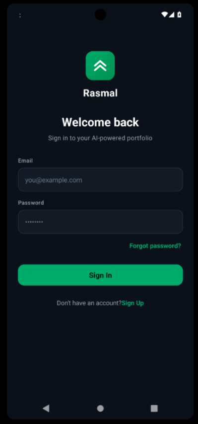
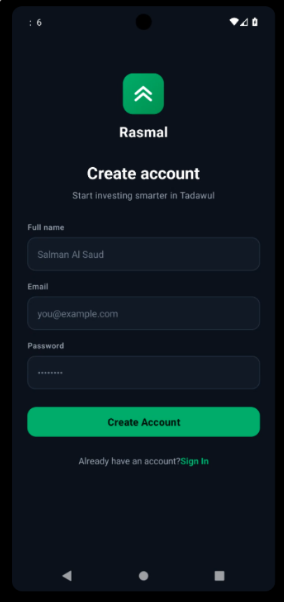
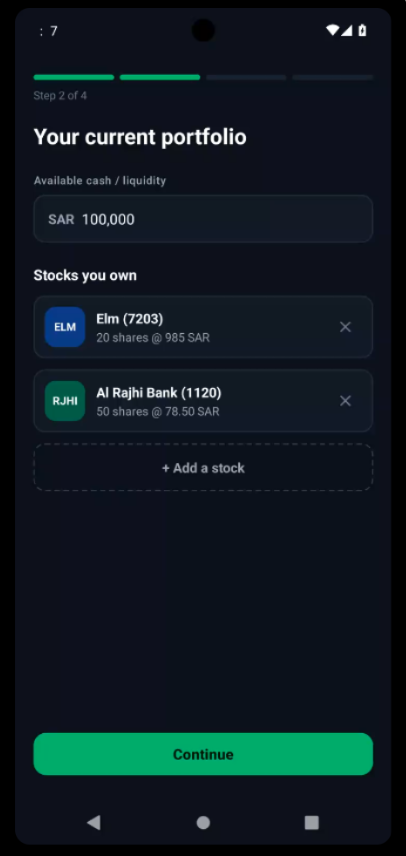
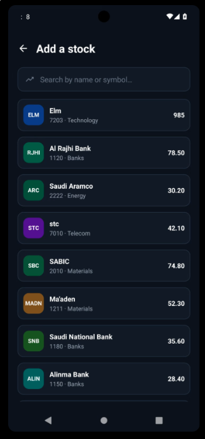
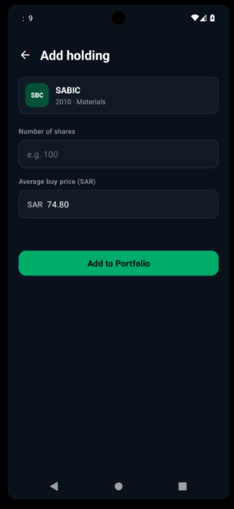
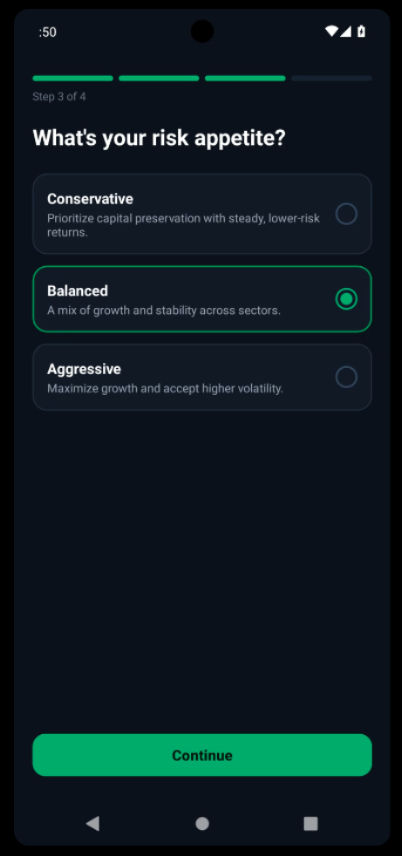
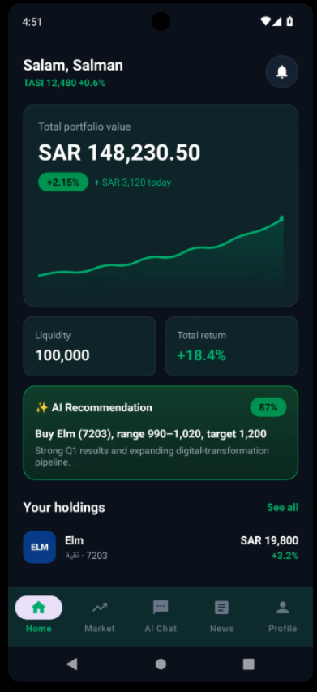
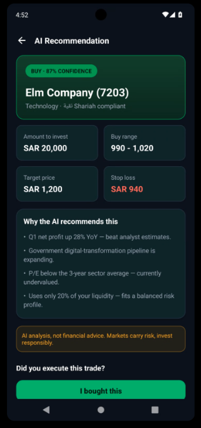
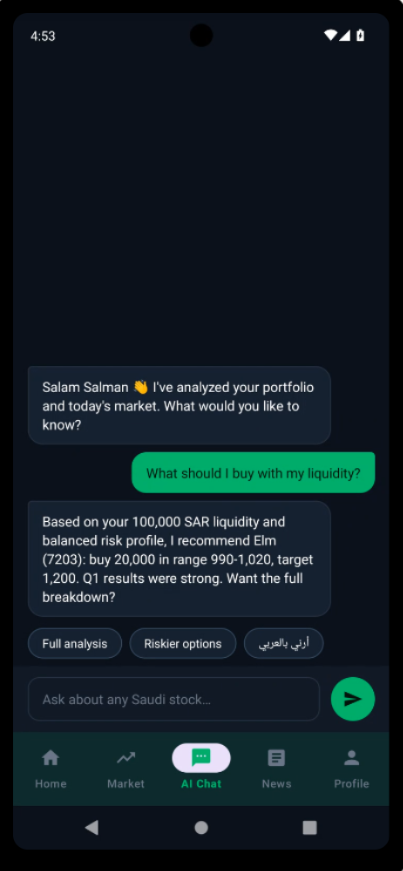

# Rasmal 📈

**AI‑powered portfolio companion for the Saudi stock market (Tadawul).**

Rasmal is a native Android app that lets a user sign up, describe their portfolio and risk appetite, and get real, personalized AI recommendations and chat about Saudi (Tadawul) stocks — backed by a Supabase backend and an LLM — all wrapped in a clean, dark, Material 3 interface.


> ℹ️ **Status: real backend, wired end‑to‑end.**
> The app now runs on a **Supabase backend** — email/password **Auth**, a Postgres database with **Row‑Level Security**, and **Edge Functions** that score Saudi stocks and proxy an LLM for recommendations and chat. **No third‑party API keys ship in the APK**; the app talks only to Edge Functions and PostgREST using the signed‑in user's JWT.
>
> A few things remain seeded or mock while Sprint 3 is pending: the dashboard **performance chart** is still demo data, company **financial statements** are hand‑seeded (the free market‑data tier omits them), and the **Shariah** label is a placeholder. Recommendations are **AI analysis, not financial advice.** See the [backlog status](#-backlog-status) for the exact picture.

---

## 📱 Screenshots

> Capture these from the running app (e.g. appetize.io has a screenshot button) and drop the PNGs into the [`screenshots/`](screenshots/) folder using the filenames below — they'll appear here automatically. See [`screenshots/README.md`](screenshots/README.md) for the exact list.

| Sign In | Sign Up | Onboarding · Portfolio |
|---|---|---|
|  |  |  |

| Add Stock · Search | Add Stock · Details | Onboarding · Risk |
|---|---|---|
|  |  |  |

| Dashboard | AI Recommendation | AI Chat |
|---|---|---|
|  |  |  |

---

## ✨ Features

- **Authentication (real)** — Sign Up / Sign In via **Supabase Auth**. Client‑side validation, duplicate‑email detection, email‑confirmation support, and a session persisted on device so you stay signed in. Sign out revokes the session.
- **Onboarding flow** (reached via Sign Up):
  - **Portfolio step** — declare available cash and the stocks you own. Cash is **persisted to your Supabase profile**.
  - **Add a stock** — search a Tadawul catalog by name / symbol / ticker, pick a stock, then enter your **number of shares** and **average buy price**; the holding is **saved to Supabase**.
  - **Risk step** — choose Conservative / Balanced / Aggressive; the choice is **persisted and feeds recommendations**.
- **Dashboard (real)** — total portfolio value, **today's P&L**, **total return**, and **available liquidity** computed from your holdings and live cached quotes. (Performance chart is still demo data.)
- **Manage holdings (real)** — add, **edit**, or **remove** a holding; changes sync to Supabase and the portfolio recalculates.
- **AI Recommendation (real)** — a hybrid scoring engine ranks Saudi companies for your risk profile and an LLM narrates it: amount to invest, buy range, target, stop, reasoning bullets, and a confidence level.
- **Trade Confirmation (real)** — after a recommendation, confirm whether you **bought or sold**, enter the **actual price and quantity**, and the portfolio updates (weighted‑average cost on buys; reduce/close on sells). Each trade is stored in a per‑user ledger.
- **AI Chat (real)** — ask about your portfolio or any Saudi stock; answers come from the LLM with your conversation history as context.

### Screen flow

```
Sign In ──► Sign Up ──► Onboarding: Portfolio ──► Add a stock (search ──► details)
                                     │                    ▲
                                     │            (tap a row to edit)
                                     ▼
                              Onboarding: Risk ──► Dashboard ──► AI Recommendation ──► Confirm trade
                                                        └──────► AI Chat
```

> Note: **Sign In routes to the Dashboard** if you've onboarded, otherwise to onboarding. The onboarding questions appear the first time through.

---

## ✅ Backlog status

Sprints 1–2 are complete. Legend: ✅ done · 🟡 partial · ⬜ not started (Sprint 3).

| # | Component | Story | Status | Notes |
|---|-----------|-------|:------:|-------|
| 001 | Registration | Registration | ✅ | Supabase Auth sign‑up; validation, duplicate‑email + email‑confirmation handling. |
| 002 | Login & Auth | Login and Authentication | ✅ | Sign in, session persisted across launches, routing to onboarding/dashboard, sign out. |
| 003 | Onboarding | Portfolio Setup | ✅ | Holdings + available cash persisted (`profiles` + `holdings`). |
| 004 | Onboarding | Risk Profiling | ✅ | Risk appetite persisted and used as a factor in recommendations. |
| 005 | Dashboard | Portfolio Dashboard | ✅¹ | Real value, today's P&L, total return, liquidity. ¹Performance chart still mock. |
| 006 | Portfolio Mgmt | Manage Holdings | ✅ | Add, edit, and remove — all persisted (RLS‑scoped per user). |
| 007 | AI Engine | Stock Recommendation | ✅ | Scoring engine over cached market data + seeded fundamentals; amount, buy range, target, stop. |
| 008 | AI Engine | Recommendation Reasoning | ✅ | Reasoning bullets + narrative + confidence level. |
| 009 | Portfolio Mgmt | Trade Confirmation | ✅ | Bought/sold prompt, actual price + quantity, portfolio update, trade ledger. |
| 010 | AI Chat | AI Chat Assistant | ✅ | LLM answers grounded in the user's data + conversation history. |
| 012 | Market Data | Market News Feed | 🟡 | Backend caches marketaux news (`market-refresh`); **no in‑app screen yet**. |
| 015 | Profile | Profile and Settings | 🟡 | Secure logout works; **profile/risk editing screen not built**. |
| 011 | Market Data | Shariah Compliance Filter | ⬜ | Currently a placeholder label; needs a data source + classification. |
| 013 | Notifications | Earnings Alerts | ⬜ | Upcoming‑earnings notifications not built. |
| 014 | Dashboard | Portfolio Health Analysis | ⬜ | Over‑concentration warnings not built. |

**Carry‑overs to fold into Sprint 3:** the dashboard **performance chart** (still demo data), and making the **holdings‑management screen reachable after onboarding** (today it lives only in the onboarding flow).

---

## 🛠 Tech stack

| Area | Choice |
|---|---|
| App language | **Java** |
| UI | Android Views + **Material 3**, **View Binding** |
| Navigation | **Jetpack Navigation Component** (single‑Activity, multi‑Fragment) |
| Networking | **OkHttp** → Supabase Edge Functions + PostgREST (JWT‑authenticated) |
| Backend | **Supabase** — Auth, Postgres + Row‑Level Security, **Edge Functions** (Deno / TypeScript) |
| AI | Scoring engine (rules) + **LLM via OpenRouter** for narrative & chat |
| Market data | SAHMK (quotes) + marketaux (news), cached server‑side via a scheduled function |
| Charts | Custom `LineChartView` (canvas‑drawn) |
| Build | Gradle (Kotlin DSL) + version catalog (`gradle/libs.versions.toml`) |
| Min / Target SDK | 24 / 36 · compiled with SDK 36 · Java 11 |

---

## 📂 Project structure

```
app/src/main/
├── java/com/example/rasmal/
│   ├── MainActivity.java          # single Activity, hosts the nav graph
│   ├── auth/                      # SupabaseAuth, Session, SessionManager
│   ├── data/
│   │   ├── ApiClient.java         # JWT-signed calls to Edge Functions + PostgREST
│   │   └── MockData.java          # remaining demo data (catalog, chart, fallbacks)
│   ├── model/                     # Holding, Stock, ChatMessage, Recommendation
│   ├── adapter/                   # RecyclerView adapters
│   ├── ui/                        # Fragments (one per screen)
│   └── view/LineChartView.java    # custom chart view
└── res/
    ├── layout/                    # XML layouts
    ├── navigation/nav_graph.xml   # screen graph + actions
    ├── drawable/                  # icons, backgrounds, gradients
    └── values/                    # colors, strings, dimens, styles, themes

supabase/                          # the backend (see supabase/README.md)
├── migrations/                    # schema + RLS, seed, profiles, transactions
└── functions/                     # recommendations, chat, market-refresh (Deno/TS)
```

---

## 🚀 Getting started

### 1. Run the app UI

The Android app builds and runs on its own; without backend config it uses placeholder Supabase values and degrades gracefully (auth/network calls simply fail and screens fall back to demo values).

**Android Studio:** clone, open, let Gradle sync, press **Run ▶** on an emulator or Android device (native Android — iOS is not supported).

**Command line** (handy on low‑RAM machines — build the APK and run it on a device or a cloud emulator like [appetize.io](https://appetize.io)):

```bash
# On Windows, point JAVA_HOME at Android Studio's bundled JDK first:
#   set JAVA_HOME=C:\Program Files\Android\Android Studio\jbr
./gradlew assembleDebug
# → app/build/outputs/apk/debug/app-debug.apk
```

### 2. Connect it to Supabase (for the real data)

Add your project's values to **`local.properties`** (not committed) so they're compiled into `BuildConfig`:

```properties
SUPABASE_URL=https://YOUR_PROJECT.supabase.co
SUPABASE_ANON_KEY=YOUR_ANON_KEY
```

### 3. Deploy the backend

The backend lives in [`supabase/`](supabase/) and has its own setup guide — see **[`supabase/README.md`](supabase/README.md)** for API keys, secrets, and deployment. In short:

```bash
supabase link --project-ref YOUR_PROJECT_REF
supabase db push                       # applies migrations (schema, seed, profiles, transactions)
supabase functions deploy recommendations chat market-refresh
```

> **Requirements:** Android SDK 36, JDK 11+ (the one bundled with Android Studio works), and — for real data — a Supabase project. Secrets (SAHMK / marketaux / OpenRouter keys) live only as Supabase secrets, never in the app.

---

## 🤝 Contributing / working together

- Create a **feature branch** off `main` (`git checkout -b feature/my-change`), commit, and open a Pull Request for review.
- App ↔ backend boundary: the app calls **`ApiClient`**, which hits Edge Functions / PostgREST with the user's JWT. Keep third‑party keys server‑side only.
- Follow the existing structure: **one Fragment per screen** in `ui/`, register it in `res/navigation/nav_graph.xml`, and reuse the `Widget.Rasmal.*` / `Text.Rasmal.*` styles for a consistent look.
- Strings go in `res/values/strings.xml`, colors in `colors.xml`, spacing/sizes in `dimens.xml`.

---

## 🗺 Roadmap — Sprint 3

- **011 Shariah compliance filter** — classify each stock نقية / مختلطة from a real source.
- **012 Market news feed** — surface the already‑cached news in the app.
- **013 Earnings alerts** — notify users of upcoming earnings dates for their holdings.
- **014 Portfolio health analysis** — warn on single‑stock / sector over‑concentration.
- **015 Profile & settings** — edit personal details and risk preferences.
- **Carry‑overs** — real dashboard performance chart; reach the holdings‑management screen after onboarding.
